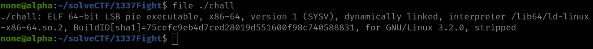
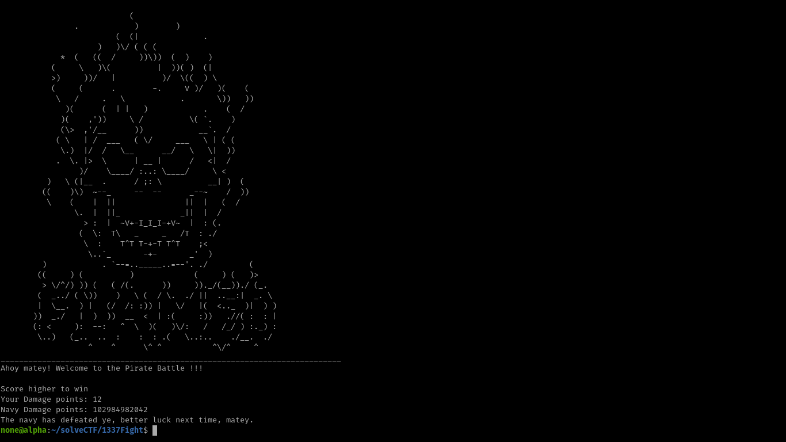
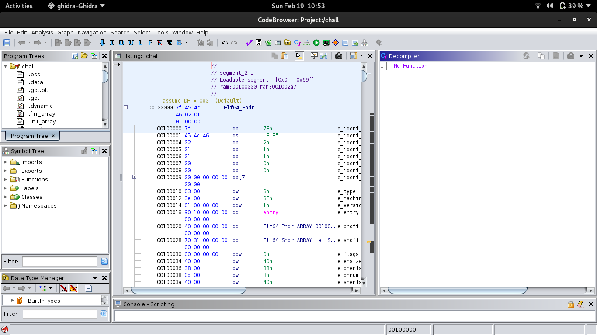
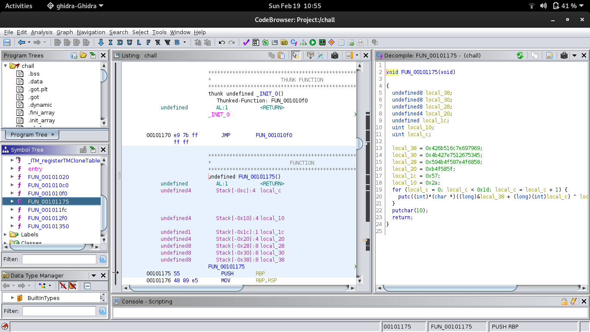
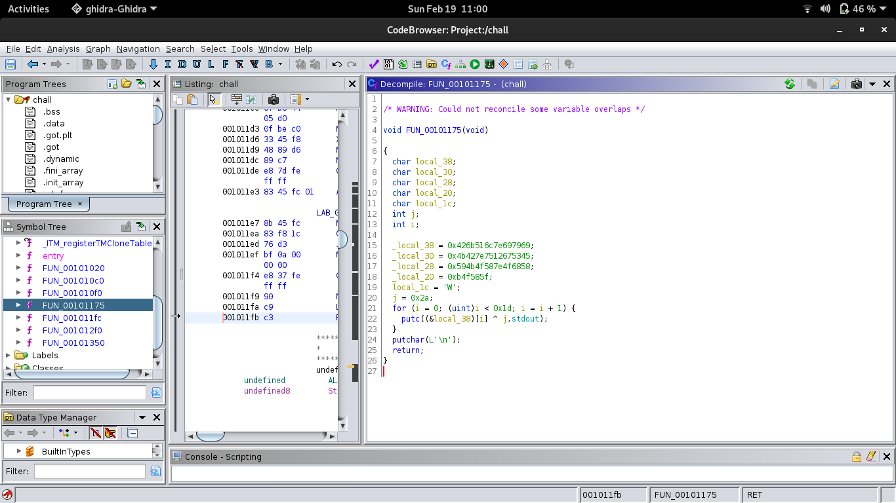
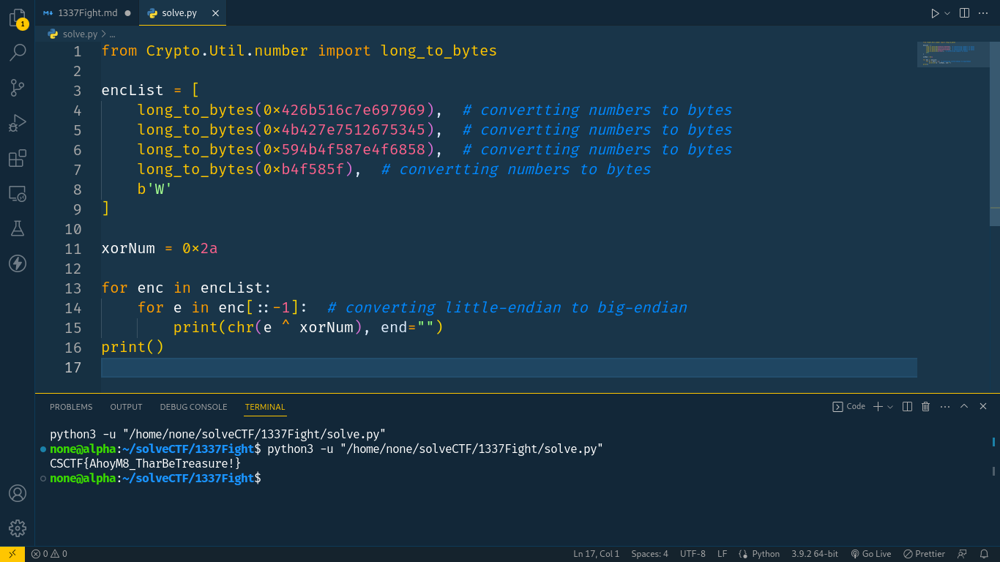

# How To Hack



As it's a **Binary ELF** file we have to give it executable permissions.

```bash
chmod +x ./chall
```



1. Open the binary in some decompiler, I'm using **Ghidra**
   

1. Look for interesting functions
   

1. Formatting that function for better understanding
   

1. Running that function in python3

```python3
from Crypto.Util.number import long_to_bytes

encList = [
    long_to_bytes(0x426b516c7e697969),  # convertting numbers to bytes
    long_to_bytes(0x4b427e7512675345),  # convertting numbers to bytes
    long_to_bytes(0x594b4f587e4f6858),  # convertting numbers to bytes
    long_to_bytes(0xb4f585f),  # convertting numbers to bytes
    b'W'
]

xorNum = 0x2a

for enc in encList:
    for e in enc[::-1]:  # converting little-endian to big-endian
        print(chr(e ^ xorNum), end="")
print()
```


