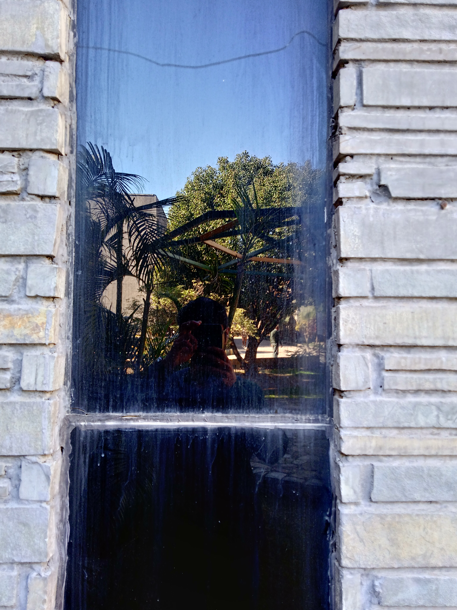
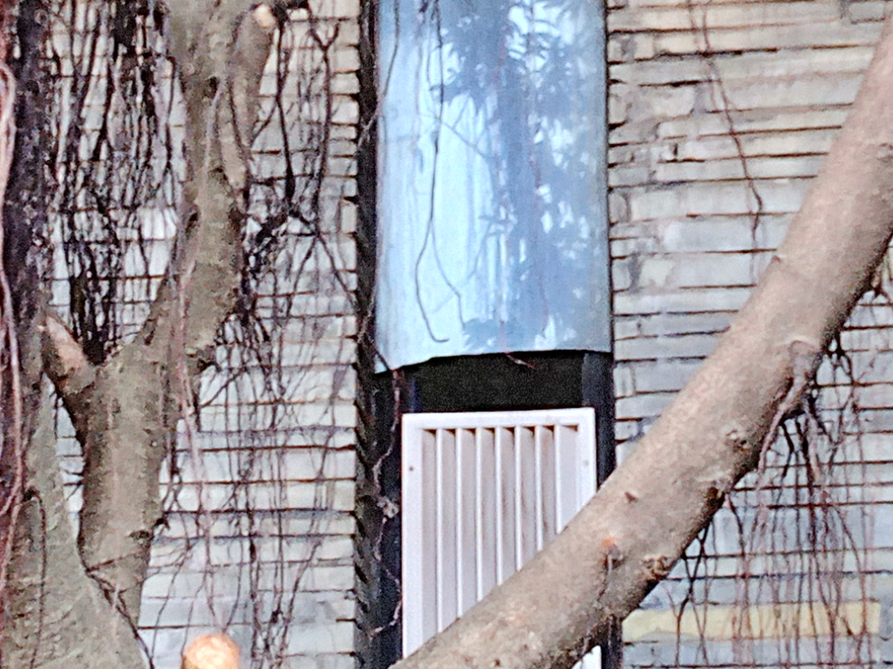
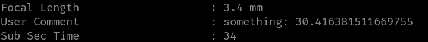
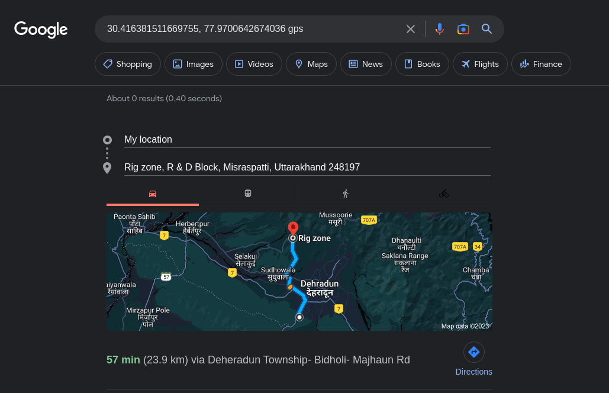

# Part 1


This is the **HUBBLE**

# Part 2


This is block1, but according to the ctf prompt it's **BLOCKNO1**

# Part 3

Running exiftool in both files



```bash
77.9700642674036 # data 1
30.416381511669755 # data 2
```

These are the Coordinates, but we don't know which one is latitude and longitude.

As we know that the place is inside the college, so we can to do hit and trial method.


As it is inside college so the part 3 of the flag is `RIG_ZONE`

`CSCTF{HUBBLE,BLOCKNO1,RIG_ZONE}`
