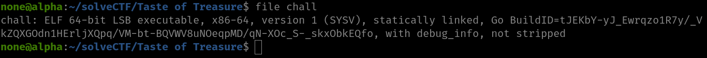
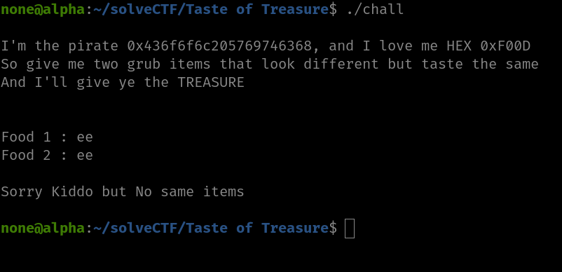
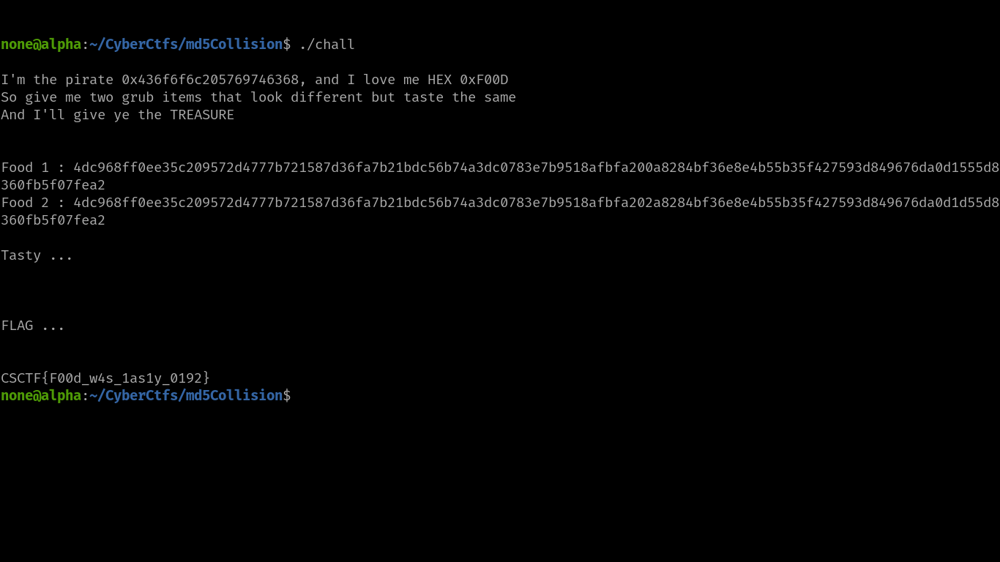

# How To Hack



As it's a **Binary ELF** file we have to give it executable permissions.

```bash
chmod +x ./chall
```



> # Assumption

1. It it likes **HEX** so, we have to give input in hexadecimal characters.
1. Our input should be different.
1. As it says that taste should be different so maybe it's related to `Md5 Collision`

> # Getting The Flag

```bash
4dc968ff0ee35c209572d4777b721587d36fa7b21bdc56b74a3dc0783e7b9518afbfa200a8284bf36e8e4b55b35f427593d849676da0d1555d8360fb5f07fea2 # input 1

4dc968ff0ee35c209572d4777b721587d36fa7b21bdc56b74a3dc0783e7b9518afbfa202a8284bf36e8e4b55b35f427593d849676da0d1d55d8360fb5f07fea2 # input 2
```


